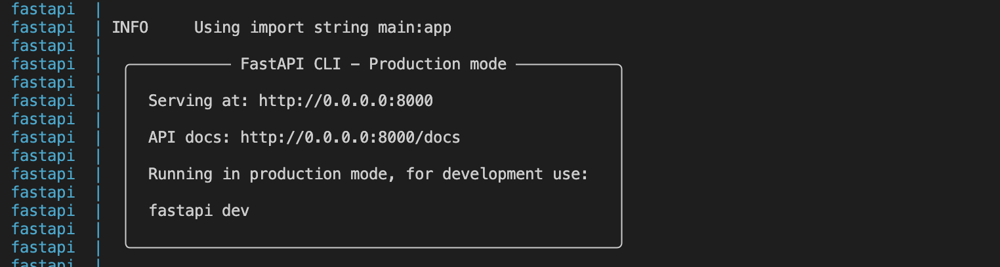
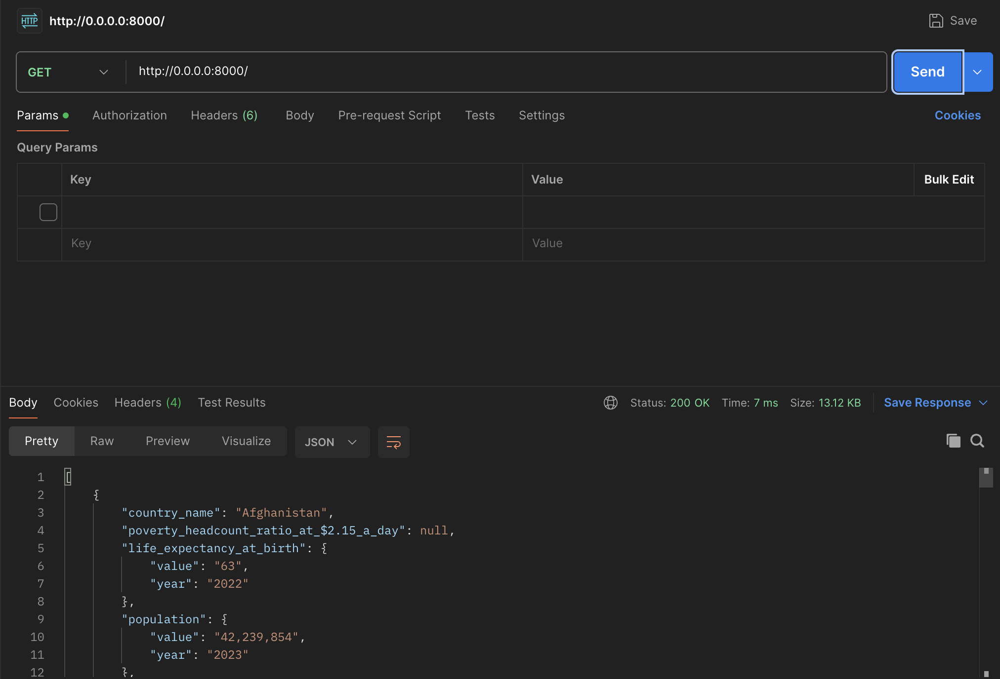
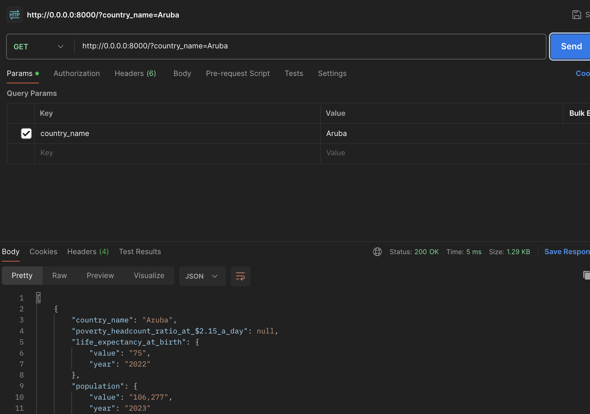
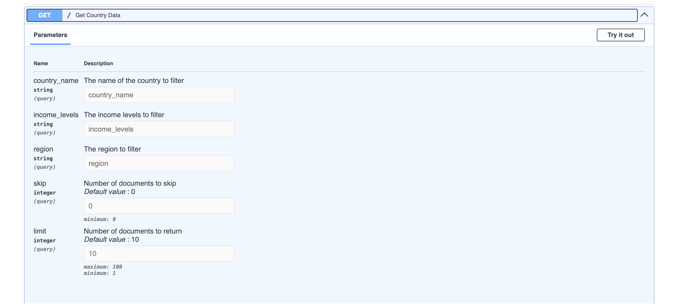
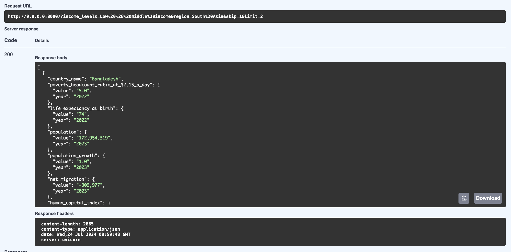
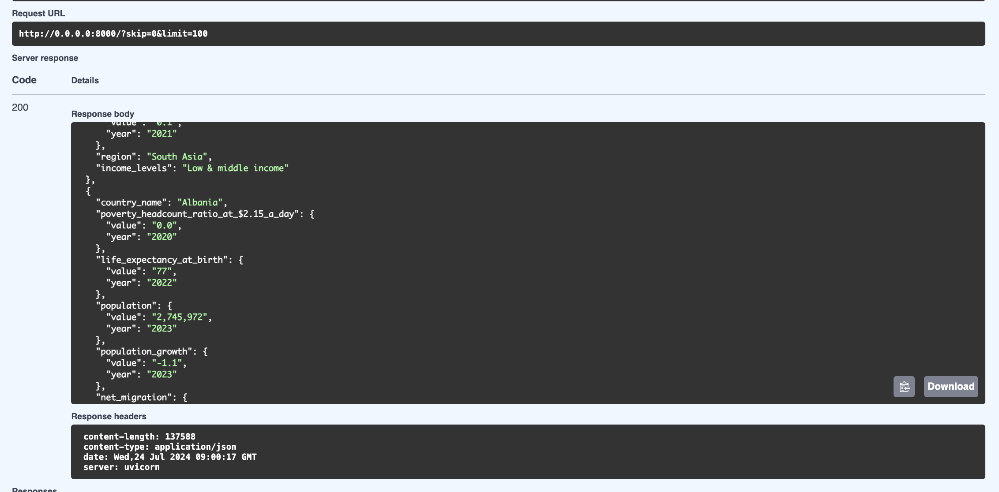

# Country Data Scraper

## Overview

This project provides a web scraper that collects country data from the World Bank website, processes it, and stores it in a MongoDB database. The scraper uses asynchronous requests to fetch and parse the data efficiently.

## Features

- Scrapes country data such as GDP, population, and life expectancy.
- Fetches metadata like region and income levels.
- Asynchronously handles HTTP requests for improved performance.
- Stores the collected data in MongoDB.
- Utilizes Docker and Docker Compose for containerization and easy deployment.

## Requirements

- Docker (Install the docker using this  [link](https://docs.docker.com/engine/install/)).

## Installation

1. **Clone the repository:**

    ```bash
    git clone <repository_url>
    cd <repository_directory>
    ```

2. **Build and run the Docker containers using Docker Compose:**

    ```bash
    docker-compose up --build
    ```

    This command will:
    - Build the Docker image defined in the `docker-compose.yml` file.
    - Start the FastAPI and MongoDB containers.

## Usage

1. **Run the scraper:**

    Once the containers are up, the scraper will automatically start and perform the following tasks:
    - Fetch keys for data fields.
    - Retrieve country data.
    - Fetch and append metadata.
    - Store the data in MongoDB.

2. **View the results:**

    Data will be stored in the MongoDB collection defined in the `database.py` file. You can access the MongoDB instance at `mongodb://localhost:27017` (default settings).

# Endpoints
There are 2 endpoints in this project:-
  - **API Response:** `/`
  - **Swagger:** `/docs`

# Project Structure
```bash
.
└── scrapper/
    ├── screenshots/
    ├── database.py
    ├── docker-compose.yml
    ├── Dockerfile
    ├── main.py
    ├── models.py
    ├── challenge.md
    ├── requirements.txt
    ├── scraper.py
    └── start
```
## Models

The project uses Pydantic models for data validation:

- `Metadata`: Represents metadata with optional `value` and `year`.
- `CountryData`: Represents country-specific data with various indicators and metadata.

See `models.py` for the full model definitions.

# Screenshot of Server running

<br><br>

# Screenshots of API Response

<br><br>

<br><br>

# Screenshots of Swagger Response

<br><br>

<br><br>
